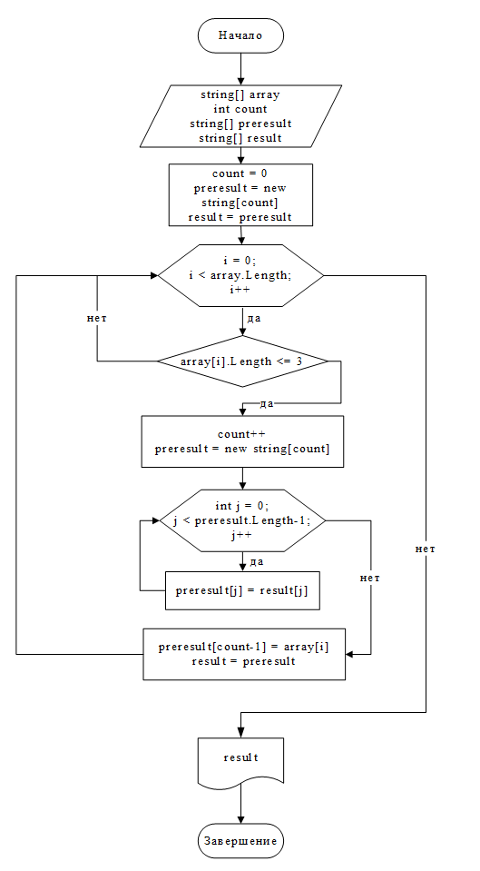

# Задача алгоритмически не самая сложная, однако для полноценного выполнения проверочной работы необходимо:

1. Создать репозиторий на GitHub
2. Нарисовать блок-схему алгоритма (можно обойтись блок-схемой основной содержательной части, если вы выделяете её в отдельный метод)
3. Снабдить репозиторий оформленным текстовым описанием решения (файл README.md)
4. Написать программу, решающую поставленную задачу
5. Использовать контроль версий в работе над этим небольшим проектом (не должно быть так, что всё залито одним коммитом, как минимум этапы 2, 3, и 4 должны быть расположены в разных коммитах)

Задача: Написать программу, которая из имеющегося массива строк формирует новый массив из строк, длина которых меньше, либо равна 3 символам. Первоначальный массив можно ввести с клавиатуры, либо задать на старте выполнения алгоритма. При решении не рекомендуется пользоваться коллекциями, лучше обойтись исключительно массивами.

# Решение:

Первоначальный массив решил задать путем запроса ввода пользователем элементов массива строк, отделяя каждый элемент массива точкой с запятой и пробелом (; ). Для чего выделил отдельный метод Prompt(), который на вход принимает текст выводимый на экран пользователю, а в результате выдает массив строк, полученный с помощью метода string.Split("; ").

Получение из первоначального массива строк нового массива из строк, длина которых меньше либо равна 3 символам, решил выделить в отдельный метод GetArrayOfThreeSymbols(), который на вход получается первоначальный массив строк, а в результате выдает новый. Алгоритм метода заключается в следующем:

   > - Вначале задаются переменные: count - длина массива, первоначальное значение которого равно 0, result - результирующий массив строк, preresult - массив строк для сохранения значений элементов предыдущего (старого) результирующего массива строк result.
    Путем цикла for проходим по всем элементам входного массива array.

   > - Внутри цикла проверяем длину строки каждого элемент массива array. При этом, если длина меньше либо равна 3 символам, то выполняем следующие действия, описанные ниже, а если условие не выполняется, то идем к следующему кругу внутри цикла for п.2.
    Увеличиваем значение переменной count на 1 и создаем новый массив preresult с длиной равной count.
    Путем нового цикла for копируем значения элементов массива строк result.
    Последнему элементу нового массива строк preresult присваиваем значение элемента массива array.
    Присваиваем result новый массив строк preresult.
    Идем к следующему кругу внутри цикла for п.2. И так до конца цикла.

   > - Возвращаем в качестве результата метода GetArrayOfThreeSymbols() массив строк result.

